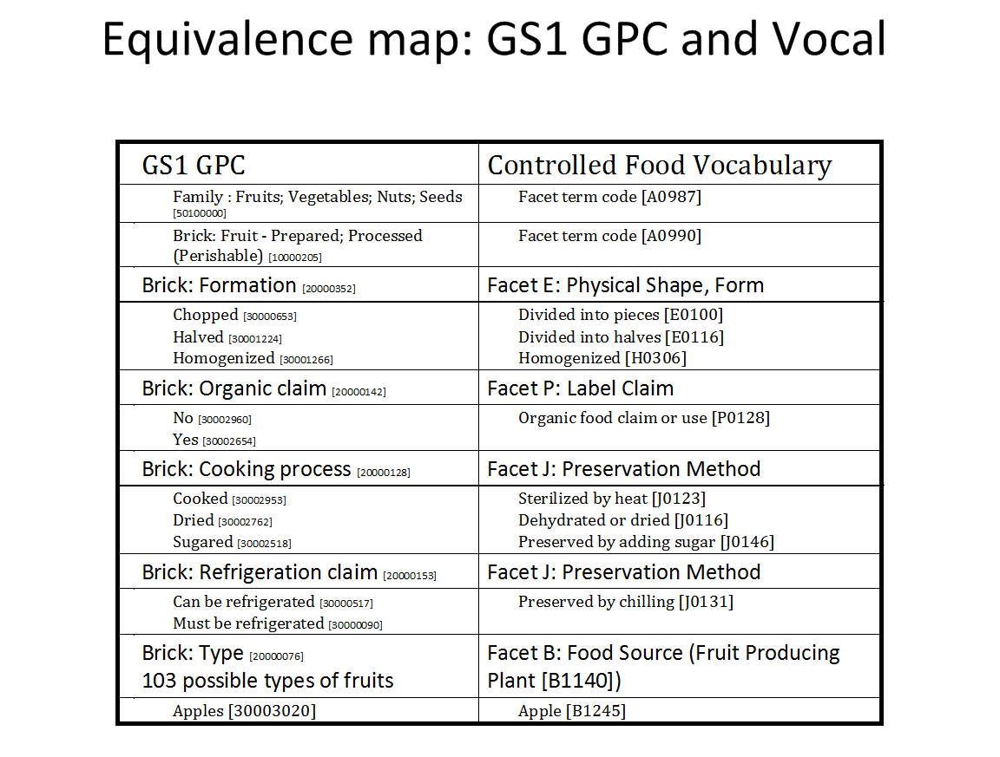

.. _$_02-core-10-deposition-OnLine-OnMessage:

===============================
OnLine and OnMessage Deposition
===============================

Table of contents for OnLine and OnMessage Deposition
-----------------------------------------------------

.. contents::
   :depth: 3
   :local:

--------------------
Deposition Workflow
--------------------

A :ref:`Depositor <terms-Depositor>` |_| registers information via:

1. :ref:`OnLine <terms-Deposition-OnLine>` |_| interface, or

2. :ref:`OnMessage <terms-Deposition-OnMessage>` |_| interface.

:ref:`OnTop <terms-OnTop>` |_| parser interacts with :ref:`ontologies <terms-Ontology>` to properly classify :ref:`deposit <terms-Deposit>`.

:ref:`USDA select <terms-USDA-Select>` |_| and :ref:`USDA prime <terms-USDA-Prime>` |_| data is complemented with data generated by :ref:`USDA mathematics <terms-USDA-Mathematics>`.

Ontomatica :ref:`graphs <terms-Graph>` |_| (representing things or events, and causal relationships between them) are updated.

Data then is stored on :ref:`MySQL <terms-MySQL>` |_| and :ref:`REST <terms-REST>` servers.

.. figure:: $_02-core-10-deposition-OnLine-OnMessage_.png
   :align: center

-----------------------------------------
Harmonization of GS1, GTIN and Vocal Data
-----------------------------------------

Explanation.

---------------------------------------
Integration of GS1, GTIN and Vocal Data
---------------------------------------

OnMessage enables construction of a comprehensive food record that includes bar code information (GTIN) together with GS1 data (Brick codes), Vocal terms and related data.

.. figure:: $_02-core-10-deposition-OnLine-OnMessage-GTIN-Vocal_1_.png
   :align: center

.. |_| unicode:: 0x80

